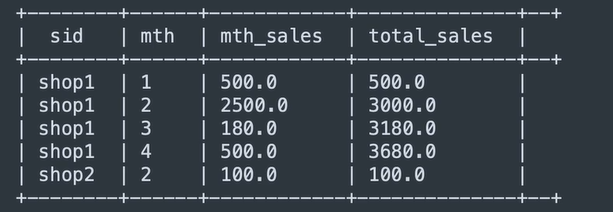
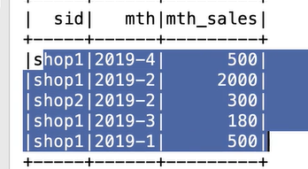
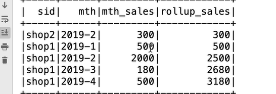

### 按月份累加金额
按月份聚合  
数据
```
shop1,2019-01-18,500
shop1,2019-01-17,500
shop1,2019-01-16,500
shop2,2019-01-18,500
shop1,2019-01-18,500
shop2,2019-01-19,500
shop2,2019-01-20,500
shop2,2019-01-10,500
```
结果

#### 1. 过滤数据
注意今年的月份和去年的月份要区分  
按月进行分组，并求`SUM(营业额)`
```sql
SELECT 
    sid,
    CONCAT_WS("-", YEAR(dt) year, MONTH(dt) month) mth
    SUM(money) mth_sales,
FROM v_orders GROUP BY sid, mth
```

#### 2. 子查询划分窗口函数排序
注意下个月的数据要累加上个月的数据 `SUM(mth_sales) OVER(PARTITION BY sid ORDER BY dt ASC ) total_sales`
```sql
SELECT 
    sid,
    mth,
    mth_sales,
    SUM(mth_sales) OVER(PARTITION BY sid ORDER BY dt ASC ) rollup_sales
--  SUM(mth_sales) OVER(PARTITION BY sid ORDER BY dt ASC ROWS BETWEEN UNDOUNDED PRECEIDING AND CURRENT ROW ) rollup_sales
FROM
(
    SELECT
        sid,
        CONCAT_WS("-", YEAR(dt) year, MONTH(dt) month) mth
        SUM(money) mth_sales,
    FROM v_orders GROUP BY sid, mth
)
```
